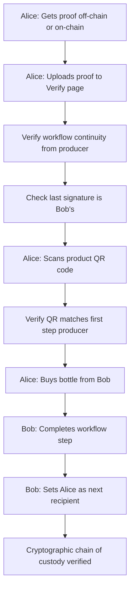

# 🥃 Workflow Macallan 25 Years - Données Structurées

## ÉTAPE 1 : PRODUCTION

```json
{
  "producerName": "Macallan Distillery",
  "spiritType": "whisky",
  "productName": "Macallan 25 Years Single Malt Speyside",
  "batchNumber": "MAC-2024-B47",
  "bottleNumberRange": "1-2400",
  "totalBottlesProduced": 2400,
  "distillationYear": 1999,
  "bottlingYear": 2024,
  "ageYears": 25,
  "volumePerBottle": 0.7,
  "alcoholPercentage": 43,
  "distillationLocation": "Speyside, Scotland",
  "caskType": "Sherry Oak (European Oak)",
  "caskOrigin": "Jerez, Spain",
  "colorDescription": "Deep mahogany",
  "qrCodeApplied": true,
  "certifications": ["Scotch Whisky", "Single Malt", "25 Years Age Statement"],
  "productionNotes": "Twenty-five years of patience in hand-selected sherry casks from Jerez. Batch B47: 2,400 bottles of Scottish excellence."
}
```

---

## ÉTAPE 2 : TRANSFER_1 (Macallan → Edrington UK)

**Fév 2024 - Batch complet : 2,400 bottles**

```json
{
  "transfer1": {
    "transferDate": "2024-02-15",
    "fromEntity": "Macallan Distillery",
    "toEntity": "Edrington UK",
    "batchNumber": "MAC-2024-B47",
    "bottleNumberRange": "1-2400",
    "bottlesInLot": 2400,
    "volumeTotal": 1680,
    "storageConditions": "High-security vault, 16°C, humidity 60%, 24/7 monitoring",
    "qualityCheck": "conforme",
    "qualityInspection": "Each bottle inspected individually",
    "transportMethod": "Secured refrigerated truck",
    "customsDocLicense": "UK-DIST-SPIRITS-2024-8847",
    "customsDocCid": "bafkreiaa4h7xkjvnzqmqvwfqrjh5b3k2l9m8n7o6p5q4r3s2t1u0v9w8x7y6z5",
    "transferNotes": "Complete batch B47 under maximum protection. Official guardian receives all 2,400 bottles."
  }
}
```

---

## ÉTAPE 3 : TRANSFER_2 (Edrington UK → Paris)

**Mars 2024 - Sélection : 500 bottles (range dans 1-2400)**

```json
{
  "transfer2": {
    "transferDate": "2024-03-01",
    "fromEntity": "Edrington UK",
    "toEntity": "La Maison du Whisky, Paris",
    "batchNumber": "MAC-2024-B47",
    "bottleNumberRange": "1-500",
    "bottlesInLot": 500,
    "volumeTotal": 350,
    "storageConditions": "Temperature-controlled warehouse 18°C, Paris",
    "qualityCheck": "conforme",
    "authenticityVerified": true,
    "transportMethod": "Temperature-controlled truck from UK",
    "importLicense": "FR-IMP-SPIRITS-2024-3392",
    "importLicenseCid": "bafkreibb5i8ylkwoa1rnrxwgrsji6c4m0n9o8p7q6r5s4t3u2v1w0x9y8z7a6",
    "originCertificate": "UK-ORIGIN-SCOTCH-2024-7712",
    "originCertificateCid": "bafkreicc6j9zmlxpb2soszxhstk7d5n1o0p9q8r7s6t5u4v3w2x1y0z9a8b7",
    "transferNotes": "500 bottles selected for France & Asian premium market. First selection from batch B47."
  }
}
```

---

## ÉTAPE 4 : TRANSFER_3 (Paris → Hong Kong)

**Avril 2024 - Sélection premium : 150 bottles (range dans 1-500)**

```json
{
  "transfer3": {
    "transferDate": "2024-04-10",
    "fromEntity": "La Maison du Whisky, Paris",
    "toEntity": "Golden Dragon Spirits, Hong Kong",
    "batchNumber": "MAC-2024-B47",
    "bottleNumberRange": "1-150",
    "bottlesInLot": 150,
    "volumeTotal": 105,
    "storageConditions": "Air cargo 18°C, GPS tracked, secured container",
    "qualityCheck": "conforme",
    "transportMethod": "Air cargo - Flight CX8847-HKG",
    "gpsTracking": true,
    "insuranceValue": 180000,
    "insuranceCurrency": "EUR",
    "exportLicense": "HK-EXP-SPIRITS-2024-9987",
    "exportLicenseCid": "bafkreidd7k0anmyqc3tptzyjtvl8e6o2p1q0r9s8t7u6v5w4x3y2z1a0b9c8",
    "customsDeclaration": "DAU FR-HK-2024-9987",
    "customsDeclarationCid": "bafkreiee8l1bonyrd4uquazkvwm9f7p3q2r1s0t9u8v7w6x5y4z3a2b1c0d9",
    "airWaybill": "AWB CX8847-HKG",
    "airWaybillCid": "bafkreiff9m2cpozse5vrvbklwxn0g8q4r3s2t1u0v9w8x7y6z5a4b3c2d1e0",
    "transferNotes": "150 bottles chosen for Chinese collectors. €180K insurance. Elite selection crossing continents by air."
  }
}
```

---

## ÉTAPE 5 : TRANSFER_4 (Hong Kong → Shanghai)

**Avril 2024 - Import Chine : 150 bottles (range dans 1-150)**

```json
{
  "transfer4": {
    "transferDate": "2024-04-15",
    "fromEntity": "Golden Dragon Spirits, Hong Kong",
    "toEntity": "Shanghai Premium Imports Co. Ltd",
    "batchNumber": "MAC-2024-B47",
    "bottleNumberRange": "1-150",
    "bottlesInLot": 150,
    "volumeTotal": 105,
    "storageConditions": "Bonded warehouse Shanghai Free Trade Zone - B7, climate controlled",
    "qualityCheck": "conforme",
    "qrBlockchainVerified": true,
    "transportMethod": "Bonded transport Hong Kong to Shanghai",
    "importLicense": "CN-IMP-SPIRITS-2024-5571",
    "importLicenseCid": "bafkreigg0n3dqpate6wsxcmlxy01h9r5s4t3u2v1w0x9y8z7a6b5c4d3e2f1",
    "gaccCertificate": "GACC-SPIRITS-2024-CN-8834",
    "gaccCertificateCid": "bafkreihh1o4erqbuf7xtydnmyz12i0s6t5u4v3w2x1y0z9a8b7c6d5e4f3g2",
    "healthCertificate": "CN-HEALTH-IMPORT-2024-7729",
    "healthCertificateCid": "bafkreiii2p5fsrcvg8yuzeonza23j1t7u6v5w4x3y2z1a0b9c8d7e6f5g4h3",
    "bilingualLabeling": true,
    "labelingLanguages": ["EN", "CN"],
    "transferNotes": "Chinese customs cleared. GACC health certificate obtained. All 150 bottles QR-verified on blockchain. Ready for mainland distribution."
  }
}
```

---

## ÉTAPE 6 : TRANSFER_5 (Shanghai → Retail)

**Mai 2024 - Distribution retail : Bouteille #892 (dans range 1-150)**

```json
{
  "transfer5": {
    "transferDate": "2024-05-01",
    "fromEntity": "Shanghai Premium Imports",
    "toEntity": "Emperor's Cellar Shanghai",
    "batchNumber": "MAC-2024-B47",
    "bottleNumber": "892",
    "volumeUnit": 0.7,
    "storageConditions": "Climate cellar 18°C, humidity 65%, high-security display, VIP tasting room",
    "qualityCheck": "conforme",
    "blockchainVerified": true,
    "provenanceVerified": "Scotland → Shanghai complete",
    "transportMethod": "Secured delivery to premium retail",
    "retailPrice": 28800,
    "retailCurrency": "CNY",
    "retailPriceEUR": 3600,
    "vipServicesIncluded": true,
    "transferNotes": "Ultra-premium specialist receives bottle 892. Climate cellar 18°C, humidity 65%. Complete provenance Scotland → Shanghai verified. VIP services. Ready for collectors."
  }
}
```

---

## ÉTAPE 7 : FINAL DESTINATION (Consommateur)

**Achat final : M. Wei Chen - Bouteille #892**

```json
{
  "finalDestination": {
    "purchaseDate": "2024-05-15",
    "consumerName": "Mr. Wei Chen",
    "retailerName": "Emperor's Cellar Shanghai",
    "consumerType": "particulier",
    "purchaseLocation": "Shanghai, China",
    "finalDestination": "Shanghai, China",
    "batchNumber": "MAC-2024-B47",
    "bottleNumber": "892",
    "purchasePrice": 28800,
    "purchaseCurrency": "CNY",
    "usage": "Collection",
    "tastingDate": "2024-06-01",
    "rating": 5,
    "tastingNotes": "Exceptional whisky. Nose: Rich sherry, dried fruits (raisins, figs), dark chocolate, Christmas cake, subtle oak. Palate: Full-bodied, velvety smooth. Sherry sweetness balanced with spice (ginger, cinnamon). Dark fruits, orange zest, hints of coffee and leather. Finish: Very long, warm, lingering sherry and oak. Absolutely magnificent.",
    "feedback": "QR code on physical bottle + blockchain certificate = perfect match. I can prove to anyone: 7 actors signed, complete journey verified from Scotland. I don't just own a bottle. I own the proof. This is authentic luxury. Worth every yuan."
  }
}
```

---

## 🔐 SYSTÈME DE VÉRIFICATION

### 1. QR Code physique sur la bouteille

Le QR Code contient **uniquement** :

```json
{
  "productionStepHash": "0xdcdc728499cf296fabb0e0d49bfa168a378c36e8ab1352ff1af3b1ae385e9e4e"
}
```

> **Note** : Ce hash correspond à la première étape (Production) créée par Macallan. C'est le point d'entrée du workflow.

---

### 2. Processus de vérification (Chain of Custody)



---

### 3. Étapes détaillées de vérification

#### Étape 1 : Alice obtient la preuve
- Alice peut obtenir le fichier de preuve :
  - **Off-chain** : Bob lui donne le fichier JSON
  - **On-chain** : Alice récupère via le content hash depuis la blockchain

#### Étape 2 : Alice upload la preuve sur Verify page
- Upload du fichier JSON de preuve
- Le système lit le `productionStepHash` initial

#### Étape 3 : Vérifier la continuité du workflow
- Le système reconstruit la chaîne depuis la production :
  - Production → Transfer1 → Transfer2 → Transfer3 → Transfer4 → Transfer5 → Final
- Vérifie que chaque étape signe cryptographiquement la suivante

#### Étape 4 : Vérifier la dernière signature
- Le dernier acteur dans la chaîne doit être Bob (Emperor's Cellar)
- Sa signature cryptographique doit être valide

#### Étape 5 : Alice scanne le QR du produit physique
- QR Code → `productionStepHash`
- Compare avec le hash de production dans la preuve

#### Étape 6 : Vérification de correspondance
- **QR du produit** ↔ **Premier step de la preuve blockchain**
- Si match → Le produit physique correspond au certificat blockchain

#### Étape 7 : Alice achète la bouteille à Bob
- Transaction physique + transfert de propriété

#### Étape 8 : Bob complète le workflow
- Bob crée une nouvelle étape "Final Destination"
- Signe cryptographiquement avec sa clé privée

#### Étape 9 : Bob désigne Alice comme prochain destinataire
- `_targetAddress` = Adresse Substrate d'Alice
- Alice peut maintenant décrypter et prouver qu'elle est la propriétaire légitime

#### Étape 10 : Chaîne de custody complète ✅
- 7 acteurs ont signé cryptographiquement
- QR physique ↔ Blockchain certificate
- Alice possède la preuve irréfutable d'authenticité

---

### 4. Timeline du Workflow

| Étape | Date | Acteur | Bottle Range | Signatures |
|-------|------|--------|--------------|------------|
| **Production** | 1999-2024 | Macallan Distillery | 1-2400 | ✅ Macallan |
| **Transfer_1** | Fév 2024 | Edrington UK | 1-2400 | ✅ Edrington |
| **Transfer_2** | Mars 2024 | La Maison du Whisky, Paris | 1-500 ✓ | ✅ La Maison |
| **Transfer_3** | Avril 2024 | Golden Dragon, Hong Kong | 1-150 ✓✓ | ✅ Golden Dragon |
| **Transfer_4** | Avril 2024 | Shanghai Premium Imports | 1-150 | ✅ Shanghai Imports |
| **Transfer_5** | Mai 2024 | Emperor's Cellar | #892 ✓✓✓ | ✅ Emperor's Cellar |
| **Final** | Mai 2024 | Mr. Wei Chen | #892 | ✅ Wei Chen |

✓ = Range réduit (sélection)

---

## 📊 Récapitulatif Entonnoir

```
Production (1999-2024)      : 2,400 bottles (Batch B47 complet)
     │                         Range: 1-2400
     ↓
Transfer_1 (Fév 2024)       : 2,400 bottles → Edrington UK
     │                         Range: 1-2400 (complet)
     ↓
Transfer_2 (Mars 2024)      :   500 bottles → La Maison du Whisky
     │                         Range: 1-500 (sélection pour France/Asie)
     ↓
Transfer_3 (Avril 2024)     :   150 bottles → Golden Dragon HK
     │                         Range: 1-150 (sélection premium Chine)
     ↓
Transfer_4 (Avril 2024)     :   150 bottles → Shanghai Imports
     │                         Range: 1-150 (même lot, douane CN)
     ↓
Transfer_5 (Mai 2024)       :     1 bottle → Emperor's Cellar
     │                         Bottle: #892 (retail distribution)
     ↓
Final Destination (Mai 2024):     1 bottle → Mr. Wei Chen
                                  Bottle: #892 (consommateur final)
```

---

## 🎯 Points Clés du Système

### ✅ Cohérence des Bottle Ranges
- Transfer_2 range (1-500) ⊆ Transfer_1 range (1-2400) ✓
- Transfer_3 range (1-150) ⊆ Transfer_2 range (1-500) ✓
- Transfer_4 range (1-150) ⊆ Transfer_3 range (1-150) ✓
- Transfer_5 bottle #892 ∈ Transfer_4 range (1-150) ✓

### 📄 Documents Légaux Archivés (CIDs)
Tous les documents importants ont leur CID IPFS :
- Licences d'import/export
- Certificats d'origine
- Déclarations douanières
- Certificats GACC (Chine)
- Air Waybills
- Certificats sanitaires

### 🔐 Sécurité Cryptographique
- **QR Code** : Hash de production uniquement
- **Chain of custody** : 7 signatures cryptographiques
- **Vérification** : QR ↔ Premier step blockchain
- **Propriété** : `_targetAddress` pour chaque transfert

---

## 💡 Résumé pour Claude Desktop (MCP)

**Workflow Hash** : `0x798b98e5111637858589ad28b9384eccd4e0ad6fa1f2b89a16be6a70e68ca2d1` (spirits-trace-v3)

**Structure** :
1. Production (batch complet 2400)
2. Transfer_1, Transfer_2, Transfer_3, Transfer_4, Transfer_5 (étapes uniques, pas array)
3. Final Destination (consommateur)

**Validation** :
- Bottle ranges cohérents (entonnoir)
- Documents légaux avec CIDs
- QR = production step hash
- Chain of custody vérifiable

**6 mois, 3 continents, 7 acteurs, €180K assurance**  
**Mr. Wei Chen détient la preuve irréfutable d'authenticité**

